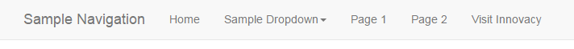
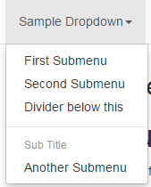

# Up!
An extremely simple, yet powerful markdown-based CMS

Supports:

  * HTML5 and CSS3
  * Navigation
  * Bootstrap
  * Themes
  * jQuery
  * Search

... without writing one line of any code, HTML or CSS.

**WARNING:** This is a work in progress (where stated). This document describes for now the features of the very first planned release that will follow very shortly.

## There are hundreds markdown parsers, why one more?

Because there is none like this one. All markdown parsers I found generally take a markdown line and convert it.
They are usually not file-focused and anything more complex requires writing code.

Up! serves a very specific purpose: Not to just parse markdown, but easily create associated markdown files that
make up a complete website.

##### My problem was this:

I needed to write documentation for end users with three requirements:
   1. It should been easy editable by translators
   2. It should work system-independent, be effortless integrated in various systems and served to end users formatted
   3. I needed the markdown files to make up a structure (speak: navigation) and not just parsed

The solution to 1. was Markdown. One could say, I could have used Wordpress. But then, any system
I had liked to implement this documentation would depend on a wordpress installation and this was
a bad requirement. So I needed something to fulfill point 2. The solution to this was [mdwiki](http://www.mdwiki.info),
which can load and parse markdown in browser, so it was independent of anything installed on the server
or the system and technologies within which the same markdown would be implemented. And point 3 was
fulfilled by mdwiki too, as it's creating a navigation with the help of markdown, adds bootstrap, jquery,
CSS and more. Perfect!

Now, I had documentation from several software, which I served in any system (Wordpress, Prestashop, Smarty, Twig)
just with mdwiki. But I wanted to be able to combine these into one larger Helpdesk site with little to no additional
effort every time I add another software.

Though it's possible to have several separate navigations, languages and documentations, by dropping
separate mdwiki copies in the subdirectories, this would become soon become too complex and it would
still lack additional functionality or flexibility such a helpdesk would need, like search functionality,
search crawling for better SEO, better language handling and more.

##### The solution to this...

As far I could research, such a solution doesn't exist at the time of this writing! So "Up!" was born.

Up! integrates a markdown parser, keeps and extends a mkdwiki fully compatible structure to create similar pages,
that it stores as static html. Not only can the same files be used without modifications like this, but all previous
issues can be solved now with Up! and new features added to the pages.

However, Up! doesn't have to be used like in my special case with mdwiki. Up! in itself is a markdown-based CMS,
that allows anyone with extremely little effort to create complete sites with Navigation, CSS, Bootstrap, jQuery,
Themes, search functionality and in future maybe more functionality, without installing any CMS, knowing any
of these technologies and writing any HTML, CSS or other code.

The perfect solution, when the focus is the content, no matter if someone is an expert in web technologies
or has never installed or worked with Wordpress.

It's very simple, requires very little to learn and it takes less a minute to set up and takes care of everything.
As a bonus, it serves pages as fast as a server can serve static html pages.

## Getting Started (work in progress)

You'll find that everything is extremely simple to use and set up, even the advanced features are ridiculous easy to use.

As first step, you need to either download and extract the zip in an empty folder or clone the repository.

Now create a file index.md and start adding your text for the front page. Create more files as you need. You can
name them anything you want and also create subdirectories as you wish, to create any structure that serves your needs.
There are really no rules or limitations here.

That's all for a start! You could just start writing your documentation, your Helpdesk or your site right away
and concentrate on the content without worrying about anything else for now.

### Linking to other files (work in progress)

At some point, you'll probably want to link to other files in your markdown.

Say, you want to link to a file called Help.md, you can write any of the following lines:

    This a [link](Help) to Help.
    This a [link](Help.md) to Help.
    This a [link](Help.html) to Help.
    This a [link](!#Help.md) to Help. Btw, this is a mdwiki link.

Up! will properly recognize that Help.md exists and will replace it in the resulting html with a proper link.
The result will be always the same. For compatibility reasons you might want to stay though with "Help.md".
If you want to keep everything working with mdwiki, use "!#Help.md".

### Adding navigation

You can add anytime a navigation bar to your content. Create a file navigation.md in the folder you created your
index.md. In the navigation.md you create a structure like this:

    [Home](index.md)

    [Sample Dropdown]()

      * [First Submenu](first.md)
      * [Second Submenu](second.md)
      * [Divider below this](divider.md)
      - - - -
      * # Sub Title
      * [Another Submenu](another.md)

    [Page 1](page1.md)
    [Page 2](page2.md)

    [Visit Innovacy](http://www.innovacy.com/)

Up! will create a complete navigation bar with a title, dropdown menus and links from this, fully styled with CSS.

This would create a menu that looks like this:

and a dropdown like this:

You have the feature to create separate navigations for subfolders. By adding a navigation.md in the specific subfolder,
Up! will create a different navigation for all files in this subfolder and all subfolders.

This is optional though. If Up! can't find a navigation.md in the folder the md file exists, it will search the parent folders until it finds
one and use it.

### Page not found (404)

If the requested page is not found, a 404.md or a 404.html file will be searched in the requested path.

If no file is found, the parent directories up to the location of the script will be searched recursively for such
a file.

A 404.md has priority over a 404.html file, so if you want to have a html file loaded and served, make sure you remove
the 404.md file.

If no 404 file is found, a simple "File not found" error will be shown.

### Using a custom footer

A custom footer can be added to pages. A footer.md or a footer.html will be searched in the requested path.

If no file is found, the parent directories up to the location of the script will be searched recursively for such
a file.

A footer.md has priority over a footer.html, so make sure there is no footer.md is present or is found before your
preferred footer.html file.

You can add a different custom footer for some pages by creating one in a child folder. All pages in this folder and
their child folders will have this footer.

### Selecting a theme

There are two methods to set the theme:
  * In the config.json (new method, preferred, works also without navigation)
  * In the navigation.md (backwards compatible to mdwiki)

Up! comes with support for several bootstrap themes. For the preferred method, look under config.json:theme.
The following text describes only the theme feature available in navigation.md.

This works the same as in mdwiki. In the file navigation.md add a line like this:

    [gimmick:theme](theme-name)

The supported themes and their names can be found at http://bootswatch.com/ where you can see all their styles too.
Just replace 'theme-name' in the above line with your choice of theme. The default bootstrap theme can now be choicen
with "bootstrap".

If this line in navigation.md is missing, the default bootstrap look will be loaded.

The setting in config.json has priority over the one in navigation.md.

Note: This is a simplified mdwiki syntax, the full mdwiki syntax is also supported, however the inverse-attribute
isn't applied.

### Alert gimmick

Whenever a paragraph starts with a special trigger word that is followed by a colon `:` or exclamation mark `!`,
they are rendered as alert boxes.

These trigger words are case insensitive and are:

Type       | Trigger
-----------|---------
Warning    |warning, achtung, attention, warnung, atención, guarda, advertimiento
Note       |note, beachte
Hint       |hint, tip, tipp, hinweis

## Advanced Features

### Advanced custom footer (work in progress)

Alternatively to a footer.md file, the parser looks first for a footer.html and if it finds one, it will use this one
instead. This allows you to add any html code. It can also contain bootstrap classes and features, as also jQuery.
You don't need to include any of these libraries yourself, they are already automatically loaded.

### Using a custom style (work in progress)

Up! adds classes and id's to sections like navigation and footer. This way, you can change the look of any elements
of the final pages.

To add custom styles, simply create a custom.css file in the main folder. It will be loaded after any other styles.

For now, as no such list exists, inspect the generated files to see what classes and id's are available for
custom styling.

### Changing settings with config.json

You can have a config.json file in the main folder and in any of the subdirectories.

Up! looks first in the main folder for config.json file and will load it. Then it will search resursively beginning
with requested path all parents folders for a config.json. The first file that will be found, will be loaded and can
overwrite settings of the main config.json file. Only one additional config.json will be loaded, other files further up
in the folder structure will be ignored.

#### Valid settings in config.json (work in progress)
If a config.json file exists, Up! will check it. It is mostly compatible with mdwiki's settings with small differences.

Currently supported are (the values shown are defaults):

##### config.json: loadCss

This setting indicates a CSS filename without a path to load. Up! then searches for this file starting from
the requested path through all parents. The first that is found is loaded in the site.

This way, you can overwrite your styles in every folder (incl. all it's child folders) you want to.

    {
        "loadCss": "mystyle.css"
    }

##### config.json: highlightJs

    {
        "highlightJs": false
    }

By default, the highlight.js javascript library is loaded for automatic code highlighting. However, if you have
no use of this feature for your pages or just don't want to use it, you can deactivate loading of any highlightJs
resources alltogether, by setting this config setting explicitly to false.

##### config.json: theme

    {
        "theme": "bootstrap"
    }

This setting sets a theme. In case there's a theme defined in navigation.md, this setting has priority over it.
The available styles and their names to use can be seen on http://bootswatch.com. The default bootstrap theme's name
is "bootstrap".

##### config.json: additionalFooterText

    {
        "additionalFooterText": "This site is created by Innovacy"
    }

Adds the text defined to the footer. This setting is overridden and does nothing, if a footer.md or footer.html file
is added instead.

#####  Settings to be documented (work in progress)

    {
      "title": "",               // If set, will add this to the title of all pages, otherwise it will take the first header only
      "lineBreaks": "original",  // Can be "gfm" for Github flavoured line breaks
      "anchorCharacter": "#"     // Is shown on links
    }

### Custom modifications for all pages

You want to add your own modifications in the html that is generated? Nothing easier than that. Find the file
page.tpl in the Up folder and edit it as you wish. You only need to keep the variables like {$meta} in place.

## FAQ

### Can I use Up! as replacement for mdwiki?

You can. My intention creating Up! was not to replace mdwiki. I'm still using both, they are just useful for different
cases, where I however need the same content. All I do is to remove the index.html from something I prepared for mdwiki
and I have the same content served by Up!, just with the benefit that it can be fully crawled by search engines and
some additional options.

### How compatible is Up! with mdwiki?

Up! is working very well as a drop-in replacement for mdwiki, as it is mostly compatible. So if you use Up! instead of
mdwiki with the same files, you should get a very similar output. The features not supported are gimmicks (read below).

### What mdwiki gimmicks are supported?

All but two gimmicks are currently unsupported. The only gimmicks supported are alerts and themes.

It's unsure, if more gimmicks will be supported in future. If demand is high or someone else wants to implement
them, they might be supported at some time in future.

Unsupported gimmick features with the `[gimmick:feature]` syntax are currently completely removed from output
to simply showing something like `gimmick:feature` with a broken link.

